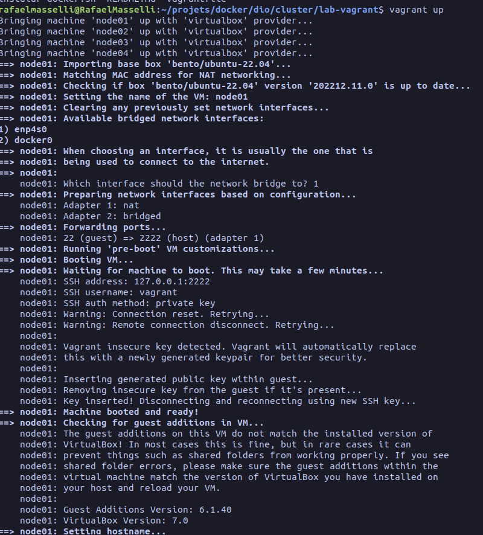
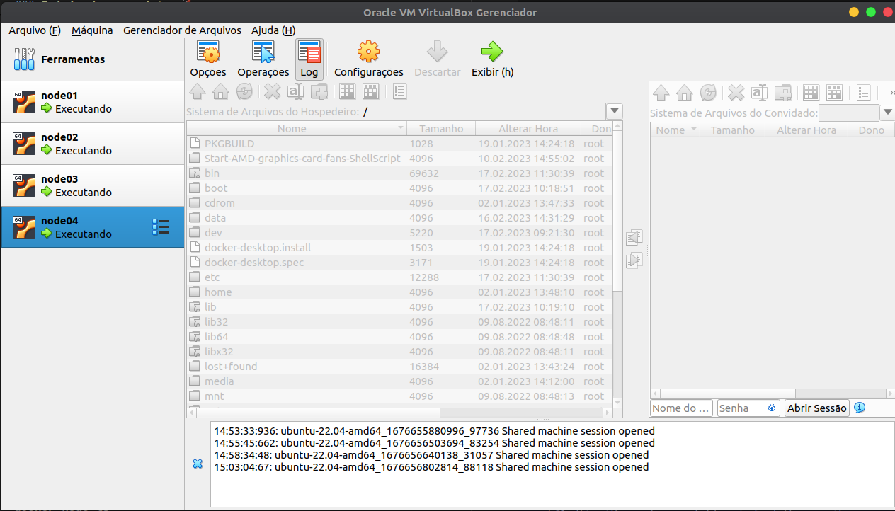
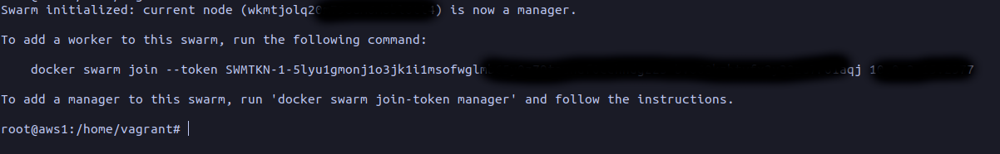
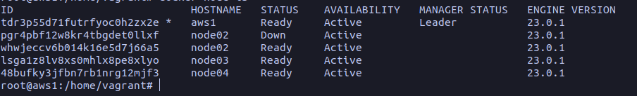

## Cluster de nuvem na maquina local

### Requisitos para iniciar o projeto

- [Vagrant](https://developer.hashicorp.com/vagrant/downloads)

- [Virtual box](https://www.virtualbox.org/wiki/Downloads)

- [Git](https://git-scm.com/download/linux)

### Iniciando o projeto 🚀

```bash
### Clone os projetos
$ git clone https://github.com/rafaelmasselli/docker-training
### Entre na pasta do projeto
cd docker-training/cluster/lab-vagrant
```

### Iniciando as maquinas virtuais

```bash
### No terminal execute o Vagrantfile com o comando
vagrant up
```

#### E assim as 4 maquinas virtuais vão ser criadas



#### Depois do comando rodar ira aparecer quatro linux ubuntu no seu virtual box



#### Depois ta instalação das maquinas virtuais entre em uma das maquinas virtuais

```bash
vagrant ssh [nome da maquina virtual]
```

#### Depois de entrar na maquina virtual crie um token para criar o laço entre as maquinas virtuais

```bash
### Senha da maquina virtual
vagrant
### ativando super usuário
sudo su
### Criando um host
hostnamectl hostname aws1
### Criando o host do cluster
docker swarm init
### Gerando o network do docker
docker swarm init --advertise-addr [ip da maquina]
```

#### E assim vai gerar um token



#### Depois de criar o token do leader do cluster copie o token e adicione as outras maquinas virtuais no server

```bash
### Entrando em outro server
vagrant ssh [nome da maquina virtual]
### E adicione a token na maquina como super usuário
docker swarm join --token [TOKEN] [IP da maquina]

```

#### Resultado depois de ter adicionado o token

```json
This node joined a swarm as a worker.
```

#### E assim faça em todas as maquinas virtuais

#### Depois de ter feito laço o cluster local vai estar pronto


