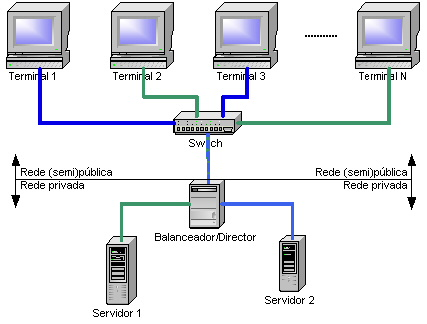

<h1 align="center">Formação em docker e Kubernetes</h1>

### O que e docker?

#### Docker é um conjunto de produtos de plataforma como serviço que usam virtualização de nível de sistema operacional para entregar software em pacotes chamados contêineres. Os contêineres são isolados uns dos outros e agrupam seus próprios softwares, bibliotecas e arquivos de configuração.

### Função do docker

#### Ele permite que os usuários criem ambientes independentes e isolados para iniciar e implantar seus aplicativos. Esses ambientes são chamados de contêineres. Isso permitirá que o desenvolvedor execute um contêiner em qualquer máquina. Com o Docker, não há mais problemas de dependência ou compilação.

### O que e Cluster?

#### Um cluster consiste em computadores fracamente ou fortemente ligados que trabalham em conjunto, de modo que, em muitos aspectos, podem ser considerados como um único sistema

### Definição de cluster

#### Você sabe o que é cluster? Palavra em inglês que significa “aglomerar”, “agrupar”, dentro da Tecnologia da Informação (TI), cluster significa integrar dois ou mais computadores para que trabalhem simultaneamente no processamento de uma determinada tarefa.
